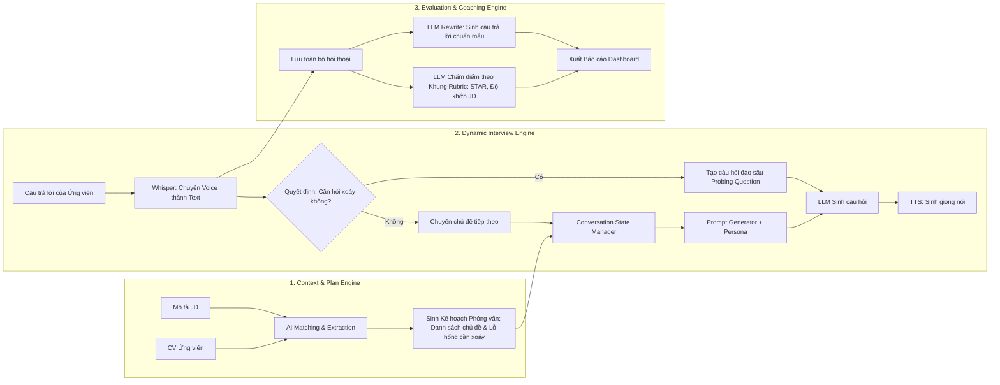

# TÀI LIỆU THIẾT KẾ HỆ THỐNG AI MÔ PHỎNG PHỎNG VẤN (AI MOCK INTERVIEW & COACHING)

> **Mục tiêu hệ thống:** Cung cấp môi trường giả lập phỏng vấn thực chiến sử dụng Trí tuệ nhân tạo (LLM), giúp ứng viên làm quen với áp lực, phát hiện lỗ hổng kỹ năng và học cách trả lời câu hỏi chuyên nghiệp theo chuẩn quốc tế.

---

## PHẦN 1: LUỒNG TRẢI NGHIỆM CỦA NGƯỜI DÙNG (USER EXPERIENCE FLOW)

Luồng người dùng được chia làm 3 giai đoạn rõ rệt: **Trước phỏng vấn (Setup) $\rightarrow$ Trong phỏng vấn (Simulation) $\rightarrow$ Sau phỏng vấn (Learning & Analytics).**

```mermaid
flowchart TD
    subgraph GĐ1 ["Giai đoạn 1: Chuẩn bị & Thiết lập"]
        A[Ứng viên đăng nhập] --> B[Tải lên CV (PDF) & Dán JD vị trí ứng tuyển]
        B --> C[Tùy chỉnh cấu hình phỏng vấn: Ngôn ngữ, Độ khó, Persona phỏng vấn viên]
        C --> D[Kiểm tra Microphone / Âm thanh]
    end

    subgraph GĐ2 ["Giai đoạn 2: Trong phòng phỏng vấn"]
        D --> E[Vào phòng phỏng vấn ảo]
        E --> F[AI chào hỏi và đặt câu hỏi phỏng vấn]
        F --> G[Ứng viên trả lời qua Giọng nói / Text]
        G --> H{AI phân tích phản xạ}
        H -- Trả lời chưa rõ / Có điểm nghi vấn --> I[AI hỏi xoáy / Đào sâu chi tiết - Probing]
        H -- Trả lời tốt / Đủ ý --> J[AI chuyển sang câu hỏi/chủ đề tiếp theo]
        I --> G
        J --> K{Hết thời gian / Đủ câu hỏi?}
        K -- Chưa --> F
        K -- Hoàn thành --> L[Kết thúc buổi phỏng vấn]
    end

    subgraph GĐ3 ["Giai đoạn 3: Phân tích & Học hỏi"]
        L --> M[Nhận Báo cáo Đánh giá Toàn diện Scorecard]
        M --> N[Xem chi tiết từng câu: Điểm mạnh, Điểm yếu, Lỗi sai]
        N --> O[Học từ 'Câu trả lời mẫu tối ưu' do AI sinh ra]
        O --> P[Chọn chế độ 'Luyện lại' những câu trả lời kém]
    end
```

### Chi tiết các bước trải nghiệm:

1. **Bước 1: Thiết lập ngữ cảnh cá nhân hóa (Context Setup)**
   * Người dùng tải lên CV (PDF/Word) và dán thông tin Mô tả công việc (Job Description - JD) của công ty họ muốn ứng tuyển.
   * Tùy chọn kiểu phỏng vấn: *Phỏng vấn Hành vi (HR/Behavioral)* hoặc *Phỏng vấn Chuyên môn (Technical/Domain)*.
   * Chọn tính cách của AI Interviewer:
     * *Thân thiện (Encouraging):* Phù hợp cho người mới, phản hồi nhẹ nhàng.
     * *Thực tế/Tiêu chuẩn (Professional):* Phỏng vấn chuẩn chỉ, tập trung vào trọng tâm.
     * *Khắt khe/Áp lực (Challenging):* Thường xuyên hỏi vặn, bắt bẻ số liệu, thử thách tâm lý.

2. **Bước 2: Tương tác trong phòng phỏng vấn (Real-time Simulation)**
   * Giao diện mô phỏng cuộc gọi 1-1 (hoặc giao diện chat kèm visual wave âm thanh).
   * AI phát âm câu hỏi bằng giọng đọc tự nhiên (TTS).
   * Người dùng trả lời bằng giọng nói (STT tự động chuyển thành văn bản) hoặc gõ phím.
   * Trong lúc phỏng vấn, người dùng có nút hỗ trợ:
     * **"Gợi ý (Hint)":** Nếu quá bí, AI có thể gợi ý hướng trả lời (sẽ bị trừ nhẹ điểm độc lập).
     * **"Xin nhắc lại":** AI đọc lại câu hỏi nếu chưa nghe rõ.

3. **Bước 3: Tiếp nhận phản hồi & Luyện tập lại (Feedback & Learning Loop)**
   * Không chỉ báo "Đạt" hay "Trượt", hệ thống cung cấp **Bảng phân tích chuyên sâu**.
   * Với mỗi câu trả lời chưa tốt, hệ thống cung cấp nút: **"Luyện lại câu này"** để người dùng sửa sai ngay tại chỗ cho đến khi đạt điểm tối ưu.

---

## PHẦN 2: LUỒNG HOẠT ĐỘNG CỦA HỆ THỐNG AI (AI SYSTEM ARCHITECTURE & LOGIC)

Dưới nền tảng, AI không chỉ đơn giản là gọi API hỏi-đáp mà hoạt động qua 3 Module chính:



### Chi tiết logic xử lý của AI:

#### 1. Module Phân tích Ngữ cảnh (Context & Strategy Engine)
* **Trích xuất thông tin:** AI bóc tách các thực thể từ CV (Kỹ năng, Dự án, Thời gian làm việc) và JD (Yêu cầu bắt buộc, Kỹ năng ưu tiên).
* **Xác định lỗ hổng (Gap Analysis):**
  * *Ví dụ:* JD yêu cầu *Kỹ năng giải quyết khủng hoảng*, nhưng CV của ứng viên chưa có minh chứng rõ ràng $\rightarrow$ Đưa chủ đề này vào danh sách ưu tiên kiểm tra.
* **Lập khung phỏng vấn:** Dự trù danh sách 5-7 câu hỏi cốt lõi bao quát từ giới thiệu bản thân, giải quyết tình huống đến câu hỏi kết thúc.

#### 2. Module Điều phối Hội thoại & Hỏi xoáy (Adaptive Probing Engine)
* Sau mỗi câu trả lời của ứng viên, AI chạy một bước **Quyết định (Probing Gate)**:
  * *Tiêu chí hỏi xoáy:* Câu trả lời quá ngắn (< 30 từ), đưa ra kết quả nhưng thiếu hành động cụ thể, nói chung chung không có số liệu, hoặc thông tin mâu thuẫn với CV.
  * Nếu phát hiện nghi vấn $\rightarrow$ Kích hoạt sub-prompt: *"Hãy đóng vai nhà tuyển dụng sắc bén, yêu cầu ứng viên làm rõ chi tiết [X] mà họ vừa đề cập"*.
  * Giới hạn độ sâu: Chỉ hỏi xoáy tối đa 2 lần cho 1 vấn đề để tránh làm cuộc phỏng vấn bị sa lầy và gây ức chế.

#### 3. Module Chấm điểm & Huấn luyện (Evaluation & Coaching Engine)
* Hoạt động ngầm sau khi kết thúc buổi phỏng vấn.
* Sử dụng LLM với cấu hình đánh giá độc lập (Evaluator Prompt) để đảm bảo tính khách quan.
* Đánh giá từng lượt hội thoại dựa trên mô hình **STAR Framework** và tiêu chuẩn ngôn ngữ ứng xử.
* Tạo ra phiên bản **"Câu trả lời tối ưu (Model Answer)"** dựa trên chính hoàn cảnh thật của ứng viên.

---

## PHẦN 3: CÁC TÍNH NĂNG CỐT LÕI (CORE FEATURES)

### 1. Nhóm Tính năng Phân tích Hồ sơ & Cá nhân hóa
* **Bộ đọc CV & JD thông minh (Smart Parser):** Tự động đọc file PDF, Word, trích xuất kinh nghiệm, học vấn, kỹ năng chính.
* **Tùy biến Persona phỏng vấn viên:** Chọn phong cách người phỏng vấn (Thân thiện, Trung lập, Khó tính/Bắt bẻ).
* **Đa ngôn ngữ:** Hỗ trợ phỏng vấn bằng **Tiếng Việt** và **Tiếng Anh**.

### 2. Nhóm Tính năng Phòng Phỏng vấn Tương tác (Interactive Room)
* **Giao tiếp Giọng nói 2 chiều (Voice-to-Voice Simulation):** 
  * Chuyển đổi giọng nói thành văn bản thời gian thực (Speech-to-Text).
  * AI phát âm giọng đọc tự nhiên (Text-to-Speech) tạo cảm giác như đang phỏng vấn online qua Zoom/Google Meet.
* **Hỏi xoáy thích ứng (Dynamic Follow-up / Probing):** AI không đọc câu hỏi theo kịch bản tĩnh mà tự động đào sâu câu trả lời của ứng viên như người thật.
* **Trợ lý khẩn cấp (In-interview Hints):** Nút cứu trợ khi ứng viên bị "đứng hình" (bí ý tưởng), gợi ý sườn ý để tiếp tục.

### 3. Nhóm Tính năng Đánh giá & Huấn luyện (Coaching & Analytics)
* **Bảng điểm năng lực (Competency Scorecard):** Chấm điểm trên thang điểm 100 theo các tiêu chí:
  * *Độ liên quan (Relevance)*
  * *Cấu trúc câu trả lời chuẩn STAR (Structure)*
  * *Độ rõ ràng & Tự tin (Clarity & Tone)*
  * *Kỹ năng chuyên môn / Xử lý tình huống (Domain Skills)*
* **Phân tích chi tiết từng câu hỏi (Turn-by-turn Feedback):**
  * Điểm mạnh (Cần phát huy).
  * Lỗ hổng / Lỗi diễn đạt (Cần khắc phục).
* **Tính năng "Viết lại xuất sắc" (AI Rewrite / Best Answer):** AI viết lại câu trả lời mẫu ngắn gọn, ấn tượng, bám sát kinh nghiệm thực tế của người dùng.
* **Chế độ Luyện tập lại có chủ đích (Targeted Retry Mode):** Cho phép người dùng bấm "Luyện lại câu này", áp dụng gợi ý của AI và trả lời lại để hệ thống chấm lại điểm ngay lập tức.

---

## PHẦN 4: BẢNG TIÊU CHÍ CHẤM ĐIỂM (EVALUATION RUBRIC)

Hệ thống đánh giá câu trả lời dựa trên khung 4 trụ cột:

| Trụ cột | Tiêu chí đánh giá | Trọng số |
| :--- | :--- | :---: |
| **1. Cấu trúc STAR** | Câu trả lời có đủ: **S**ituation (Bối cảnh) - **T**ask (Nhiệm vụ) - **A**ction (Hành động thực tế) - **R**esult (Kết quả đo lường được bằng số liệu). | 30% |
| **2. Độ bám sát (Relevance)** | Trả lời đúng trọng tâm câu hỏi, không lan man, liên kết được câu trả lời với yêu cầu của JD. | 25% |
| **3. Minh chứng & Số liệu** | Không nói lý thuyết sáo rỗng, đưa ra được ví dụ thực tế hoặc số liệu chứng minh năng lực. | 25% |
| **4. Ngôn từ & Phong thái** | Diễn đạt mạch lạc, chuyên nghiệp, hạn chế dùng từ đệm (ừm, à, kiểu như), ngữ điệu tự tin. | 20% |
