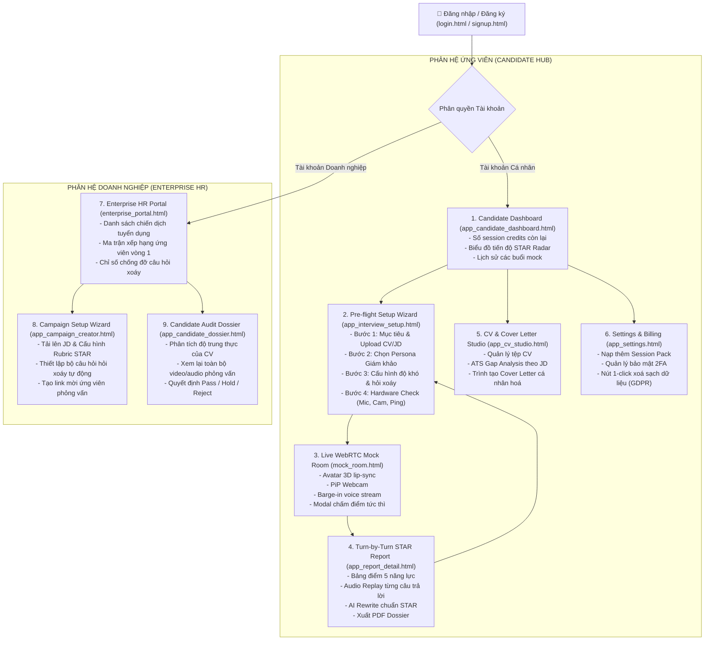

# KẾ HOẠCH THIẾT KẾ & PHÁT TRIỂN HỆ THỐNG GIAO DIỆN NGƯỜI DÙNG NỘI BỘ (IN-APP USER EXPERIENCE) &bull; TALENTAI

> [!IMPORTANT]
> Tài liệu này xác lập kiến trúc chi tiết, sơ đồ hành trình người dùng (User Journey), danh mục màn hình và lộ trình thực thi cho toàn bộ **Không gian Ứng dụng Nội bộ (In-App Web Application)** của TalentAI sau khi người dùng thực hiện Đăng nhập thành công, bao gồm cả hai phân hệ: **Ứng viên cá nhân (B2C Candidate)** và **Nhà tuyển dụng / Doanh nghiệp (B2B Enterprise)**.

---

## 1. TỔNG QUAN KIẾN TRÚC LUỒNG TRẢI NGHIỆM (USER JOURNEY)

Toàn bộ hệ thống In-App được xây dựng theo kiến trúc **App Shell thống nhất**: Sidebar điều hướng cố định (Collapsible), Topbar giám sát trạng thái thời gian thực (Credit pack balance, WebRTC connection status, Profile switcher), và Content Area linh hoạt.



---

## 2. DANH MỤC CÁC MÀN HÌNH NỘI BỘ CẦN XÂY DỰNG

### PHÂN HỆ 1: ỨNG VIÊN CÁ NHÂN (B2C CANDIDATE PORTAL)

#### Màn hình 1: Bảng Điều Khiển Trung Tâm (`app_candidate_dashboard.html`)
* **Mục tiêu**: Trung tâm chỉ huy của ứng viên, hiển thị rõ số credit phỏng vấn còn lại, tiến độ cải thiện điểm STAR và nút hành động nhanh 1-click vào phòng thi.
* **Các thành phần cốt lõi**:
  - **Credit Wallet Widget**: Thẻ hiển thị số phiên phỏng vấn còn lại (ví dụ: `4/5 phiên`), hạn dùng trọn đời, nút "+ Nạp thêm gói".
  - **STAR Competency Radar Chart**: Biểu đồ mạng nhện thể hiện 5 năng lực then chốt (Tư duy giải quyết vấn đề, Giao tiếp cấu trúc, Kỹ năng chuyên môn, Khả năng lãnh đạo, Ứng biến áp lực).
  - **Growth Velocity Bar**: Đo lường % cải thiện điểm số qua từng tuần tập luyện (+14% so với tuần trước).
  - **Recent Sessions Table**: Danh sách 5 buổi phỏng vấn gần nhất (Ngày thi, Vị trí, Giám khảo AI, Điểm STAR, Nút "Xem lại báo cáo").
  - **Quick Launch CTA**: Nút nổi bật "Bắt đầu buổi phỏng vấn mới" dẫn sang Setup Wizard.

---

#### Màn hình 2: Trình Thiết Lập Trước Giờ G (`app_interview_setup.html`)
* **Mục tiêu**: Chuẩn bị kỹ lưỡng mọi thông số trước khi bước vào phòng phỏng vấn trực tiếp, giảm thiểu lỗi kỹ thuật và tạo trải nghiệm chân thực.
* **Quy trình 4 bước (Step Wizard)**:
  1. **Bước 1: Mục tiêu Ứng tuyển & Hồ sơ**:
     - Ô nhập: Tên vị trí (Job Title) & Công ty mục tiêu (Target Company).
     - Khu vực kéo thả tệp CV (Hỗ trợ PDF/DOCX) hoặc chọn CV đã lưu trong kho.
     - Dán Job Description (JD) chi tiết để AI kích hoạt công cụ phân tích lỗ hổng kỹ năng.
  2. **Bước 2: Chọn Persona Giám khảo AI**:
     - *David Miller (Senior Director)*: Phong cách nghiêm khắc, hỏi xoáy vào số liệu P&L và tính xác thực của CV.
     - *Sarah Jenkins (Head of People)*: Tập trung vào văn hóa ứng xử, kỹ năng mềm và khả năng quản lý xung đột.
     - *Alex Chen (Principal Architect)*: Chuyên sâu kỹ thuật, System Design, bài toán kiến trúc tải cao.
     - *Rachel Vance (Executive VP)*: Phỏng vấn vị trí quản lý cấp cao, tư duy chiến lược và tầm nhìn kinh doanh.
  3. **Bước 3: Cấu hình Độ khó & Thời lượng**:
     - Thời lượng phiên: 15 phút (Express / 3 câu hỏi) &bull; 30 phút (Standard / 5 câu hỏi) &bull; 45 phút (Deep Dive / 8 câu hỏi).
     - Chế độ hỏi xoáy thích ứng (Adaptive Probing Engine): Bật/Tắt mức độ truy vấn sâu khi phát hiện luận điểm mơ hồ.
  4. **Bước 4: Kiểm tra Phần cứng Thực tế (Pre-flight Hardware Check)**:
     - **Microphone Test**: Đo cường độ âm thanh thời gian thực (Audio Waveform Meter).
     - **Camera Preview**: Xem khung hình người dùng, kiểm tra góc quay và ánh sáng.
     - **WebRTC Network Ping**: Đo độ trễ kết nối máy chủ (< 500ms đạt chuẩn).
     - Nút xác nhận: **"VÀO PHÒNG PHỎNG VẤN TRỰC TIẾP &rarr;"** (Chuyển sang `mock_room.html`).

---

#### Màn hình 3: Phòng Phỏng Vấn Giả Lập Trực Tiếp (`mock_room.html`)
* **Tình trạng**: Đã có bản nền tảng hoàn thiện, kết nối đồng bộ dữ liệu với Setup Wizard.
* **Tính năng hoạt động**:
  - AI Avatar khẩu hình cử động môi (lip-sync animation).
  - Khung hình webcam ứng viên Picture-in-Picture (PiP).
  - Sóng âm giọng nói hai chiều thời gian thực.
  - Đồng hồ đếm ngược phiên thi.
  - Nút bấm can thiệp nói (Barge-in push-to-talk).
  - Modal tự động tính điểm STAR khi hoàn tất buổi phỏng vấn.

---

#### Màn hình 4: Báo Cáo Chi Tiết Từng Câu Hỏi (`app_report_detail.html`)
* **Mục tiêu**: Màn hình giá trị nhất đối với ứng viên, cung cấp phản hồi vi mô (micro-feedback) trên từng câu trả lời.
* **Các thành phần cốt lõi**:
  - **Session Overview Header**: Điểm tổng quan (ví dụ: `84/100`), thời lượng thực tế, vị trí phỏng vấn, đánh giá tổng thể của Giám khảo AI.
  - **Competency Breakdown**: Phân tích chi tiết 5 năng lực với khuyến nghị hành động (Actionable Tips).
  - **Turn-by-Turn Interactive Transcript**:
    - Câu hỏi của AI Avatar (kèm lý do vì sao AI lại hỏi câu này dựa trên CV).
    - Câu trả lời của ứng viên + **Trình phát âm thanh Audio Player** có sóng âm để nghe lại chính xác ngữ điệu và phát âm.
    - Phân tích bóc tách cấu trúc:
      - 🟢 **Situation (Tình huống)**: Đạt 9/10 (Rõ ràng bối cảnh).
      - 🟡 **Task (Nhiệm vụ)**: Đạt 7/10 (Cần làm rõ trách nhiệm cá nhân).
      - 🟢 **Action (Hành động)**: Đạt 9/10 (Chi tiết các bước thực hiện).
      - 🔴 **Result (Kết quả)**: Đạt 5/10 (Thiếu số liệu định lượng % tăng trưởng).
    - **AI STAR Rewrite**: Văn bản viết lại mẫu lý tưởng giúp ứng viên học cách diễn đạt chuẩn mực nhất.
  - **Nút xuất Dossier PDF**: Tạo tệp PDF chuyên nghiệp để lưu trữ hoặc nộp cho mentor xem xét.

---

#### Màn hình 5: Kho CV & Studio Thư Ứng Tuyển (`app_cv_studio.html`)
* **Mục tiêu**: Nơi ứng viên quản lý các phiên bản hồ sơ của mình và sinh thư xin việc (Cover Letter) chuẩn ATS dựa trên kết quả phỏng vấn.
* **Các thành phần cốt lõi**:
  - **CV Version Manager**: Danh sách các CV đã tải lên (ví dụ: `CV_ProductManager_2026.pdf`, `CV_TechLead_2026.pdf`).
  - **ATS Gap Heatmap**: Bản đồ nhiệt thể hiện mức độ tương thích từ khoá và kinh nghiệm với JD mục tiêu.
  - **AI Cover Letter Generator**:
    - Chọn 1 CV + 1 JD mục tiêu -> Bấm "Tạo thư ứng tuyển".
    - Trình chỉnh sửa văn bản trực tiếp (Rich Text Editor) cho phép tuỳ biến tone giọng (Chuyên nghiệp / Táo bạo / Khiêm tốn).
    - Xuất file định dạng PDF hoặc Word (.docx).

---

#### Màn hình 6: Cài Đặt Tài Khoản & Quản Lý Gói (`app_settings.html`)
* **Mục tiêu**: Quản lý gói nạp, bảo mật tài khoản và thực thi quyền riêng tư minh bạch.
* **Các thành phần cốt lõi**:
  - **Gói Dịch Vụ & Nạp Credit (Billing & Session Packs)**:
    - Bảng thông tin credit hiện có.
    - Cổng mua thêm phiên nạp linh hoạt (Pack 5 phiên: 499.000đ, Pack 15 phiên: 1.199.000đ).
    - Lịch sử giao dịch & xuất hoá đơn VAT điện tử.
  - **Bảo Mật Tài Khoản**: Đổi mật khẩu, kích hoạt xác thực hai yếu tố (2FA TOTP), liên kết tài khoản Google / LinkedIn SSO.
  - **Trung Tâm Quyền Riêng Tư (Privacy & Data Governance)**:
    - Tuỳ chọn tải về toàn bộ dữ liệu cá nhân (Export JSON).
    - Nút màu đỏ: **"Xoá Vĩnh Viễn Mọi Bản Ghi Âm Thanh & Báo Cáo" (Right to Erasure)** theo đúng cam kết Nghị định 13/2023/NĐ-CP và GDPR.

---

### PHÂN HỆ 2: DOANH NGHIỆP & NHÀ TUYỂN DỤNG (B2B ENTERPRISE PORTAL)

#### Màn hình 7: Quản Trị Chiến Dịch Sàng Lọc (`enterprise_portal.html`)
* **Tình trạng**: Đã có layout nền tảng, hoàn thiện thêm chức năng chuyển tab và xuất báo cáo.
* **Các thành phần cốt lõi**:
  - Danh sách chiến dịch phỏng vấn sơ loại (Active Campaigns).
  - Ma trận bảng xếp hạng ứng viên (Leaderboard lọc theo điểm STAR, ATS match %, Điểm đối kháng hỏi xoáy).
  - Chỉ số tiết kiệm thời gian tuyển dụng (HR Hours Saved Metric).

---

#### Màn hình 8: Trình Tạo Chiến Dịch Tuyển Dụng Mới (`app_campaign_creator.html`)
* **Mục tiêu**: Doanh nghiệp thiết lập một đợt phỏng vấn sơ loại tự động cho một vị trí tuyển dụng mới.
* **Quy trình thiết lập**:
  - Tải lên JD chính thức & bộ tiêu chuẩn năng lực mong muốn.
  - Thiết lập ngưỡng điểm đạt (Cut-off score, ví dụ: STAR > 75 điểm mới được vào vòng phỏng vấn trực tiếp với Giám đốc).
  - Tự động sinh link mời ứng viên làm bài (Candidate Self-Service Invite URL & QR Code).

---

#### Màn hình 9: Hồ Sơ Thẩm Định Ứng Viên Chi Tiết (`app_candidate_dossier.html`)
* **Mục tiêu**: Bảng đánh giá chi tiết chuyên sâu dành riêng cho HR Manager / Hiring Manager duyệt kết quả của từng ứng viên.
* **Các thành phần cốt lõi**:
  - Hồ sơ năng lực tổng quan và mức độ rủi ro (Risk Analysis: CV có dấu hiệu phóng đại số liệu hay không).
  - Nghe lại các câu trả lời then chốt của ứng viên đối với câu hỏi hỏi xoáy.
  - Nút phê duyệt trạng thái: **Phê duyệt vào Vòng 2** &bull; **Đưa vào Danh sách Chờ** &bull; **Từ chối (Gửi thư tự động)**.

---

## 3. LỘ TRÌNH TRIỂN KHAI THEO THỨ TỰ ƯU TIÊN

```
GIAI ĐOẠN 1: BỘ BA TRỤ CỘT IN-APP CHO ỨNG VIÊN (Ưu tiên cao nhất)
├── 1. app_interview_setup.html  (Setup Wizard 4 bước & Hardware Check)
├── 2. app_report_detail.html    (Báo cáo chuyên sâu có Audio Replay từng câu & AI STAR Rewrite)
└── 3. app_candidate_dashboard.html (Dashboard ứng viên hoàn chỉnh thay thế bản cũ)

GIAI ĐOẠN 2: CÔNG CỤ HỖ TRỢ & HẠ TẦNG TÀI KHOẢN
├── 4. app_cv_studio.html        (Studio phân tích CV & tạo Cover Letter ATS)
└── 5. app_settings.html         (Nạp gói, hoá đơn & cơ chế xoá dữ liệu 1-click)

GIAI ĐOẠN 3: NÂNG TẦM CỔNG DOANH NGHIỆP (B2B ENTERPRISE)
├── 6. app_campaign_creator.html (Tạo chiến dịch tuyển dụng & link mời ứng viên)
└── 7. app_candidate_dossier.html(Hồ sơ thẩm định chi tiết ứng viên cho HR)
```

---

## 4. TIÊU CHUẨN THIẾT KẾ ĐỒNG BỘ (DESIGN SYSTEM STANDARDS)
* **Bảng màu chủ đạo**: `#2980B9` (Primary Brand Blue), `#1F6B9E` (Active Hover), `#0F2F45` (Executive Dark Navy), `#F8FAFC` (App Canvas Gray), `#10B981` (Success Green), `#F59E0B` (Warning Amber).
* **Typography**: Plus Jakarta Sans cho toàn bộ tiêu đề và nội dung; Font Mono cho mã số, mốc thời gian và điểm số.
* **Tương tác**: Toàn bộ widget đều có mã JavaScript mô phỏng hành vi thật (chuyển bước mượt mà, bộ đếm hoạt hoạ, audio player có thanh tiến độ giả lập, modal pop-up không cần backend server).
